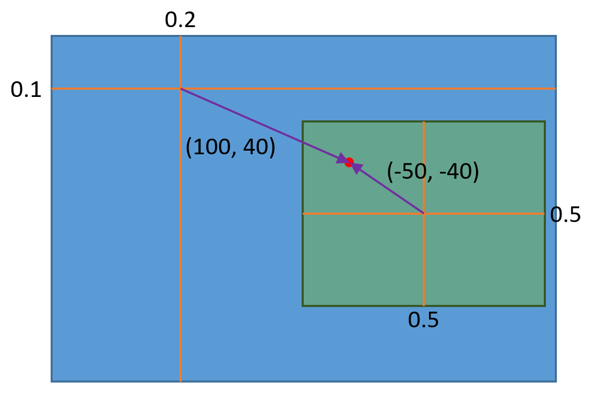

================
Legacy UI Module
================

Legacy UI 모듈은 이전에 Leggiero를 이용한 게임 개발을 위해 사용하던 미완성 UI 라이브러리 기능을 제공합니다.

Module Common Information
=========================

**Project:** *Modules/LegacyUI*

**Namespace:** ``Leggiero::LUI``

Module Interfaces
-----------------
(없음)

Components
----------
(없음)

Notes
-----
Legacy UI 모듈은 모듈 인터페이스나 엔진 컴퍼넌트를 제공하지 않고, 각종 클래스를 제공하는 순수한 API 라이브러리의 형태로 구현되어 있습니다.

다른 엔진 구성요소에 의존하는 동작이 필요한 경우, 각각의 객체 생성 시나 메서드 호출 시에 의존 대상을 직접적으로 요구합니다.

Basic Concepts and UI Object
============================

Leggiero는 게임 <Protocol:hyperspace Diver>의 개발에 이용되었던 Legacy UI 라이브러리를 제공합니다.

- Legacy UI 라이브러리는 2D UI 라이브러리로, (멀티)터치 입력을 가지는, 사이즈(해상도)가 바뀌지 않는 풀 스크린 어플리케이션을 위해 제작되었습니다.
  
- UI는 트리 구조의 UI Object로 구성됩니다.
  
- 개별 UI Object는 Entity로, UI에 필요한 기능을 수행하는 UI Component들의 집합입니다.
  

UI Object Layouting
-------------------

UI Object의 위치는 부모-자식 관계에서 상대 위치 관계를 이용하여 계산됩니다.

부모 요소에 대해 정의된 **Reference Point** 와 자식 요소에 대해 정의된 **Anchor Point** 가 일치하도록 레이아웃이 결정됩니다.

각각의 Point는:

- UI Object의 크기를 기준으로 한 비율에 해당하는 **상대 위치** 와
- 픽셀 단위의 절대적인 값으로 나타내어지는 **오프셋** 을

더해서 그 위치를 결정하게 됩니다.

UI Element
----------
UI Object는 기본적으로 entity이며 구성 컴퍼넌트들에 의해 UI 시스템 내에서의 기능을 수행하지만, 편의를 위해 자주 사용되는 종류의 UI 구성요소들을 UI Element로 구현하여 제공합니다.

UI Object를 상속한 UI Element도 UI Object이나(is-a), 해당 Element의 기능에 맞는 컴퍼넌트를 구성하고 자신의 UI 로직 처리를 수행할 수 있는 구현을 포함하고 있습니다. 또한, 일부 UI Element는 하위에 다른 UI Object를 포함할 수도 있습니다.
UI Element는 ``Leggiero::LUI::Element`` 네임스페이스에 정의되어 있으며, *Element* 서브디렉터리에서 제공되는 UI Element들을 정의한 파일들을 확인하실 수 있습니다.

어떤 UI Element는 로직 처리에 Controller 객체를 요구하기도 합니다. 공통적으로 사용되는 기본적인 Controller 클래스들을 ``Leggiero::LUI::Controller`` 네임스페이스에 정의해 두었으며, *Controller* 서브디렉터리에서 찾아보실 수 있습니다.
물론 기존의 컨트롤러를 서브클래싱하거나 아예 새로운 컨트롤러를 구현하여, UI 구성요소들을 입맛에 맞게 동작하게 만들 수도 있습니다.

UI Manager
==========

UI Manager는 UI 장면을 관리하고 처리하는 context입니다. UI Manager에서 매 프레임별 UI에 대한 상호작용 로직 처리와 랜더링이 이루어집니다.

- UI Manager에는 0개 이상의 Top UI Object들이 존재할 수 있습니다. 이들은 UI Object 트리에서의 루트 노드 역할을 하며, UI Manager는 Top UI Object 트리들을 대상으로 로직 처리와 랜더링 작업을 수행하게 됩니다.
  
- UI Manager는 컨텍스트이므로, UI Object는 Top UI Object의 하위 트리에 존재하는지의 여부에 상관 없이 하나의 UI Manager에 개념적으로 소속됩니다. 어떤 UI Manager에 소속된 UI Object를 다른 UI Manager의 context에서 사용하게 될때의 동작은 정의되어 있지 않으며, 문제를 야기할 수 있습니다.
  
- UI Manager는 다수 개 존재할 수 있습니다. 다만, 리소스 관리 등의 효율성을 위해, 게임 프로그램 전체에서 공유되는 하나의 UI Manager를 이용하고, 현재 사용되는 UI Object로 구성된 트리만을 Top UI Object로 등록하여 사용하는 프로그래밍 방식을 권장합니다.
  

UI Touch Negotiator
-------------------
UI 시스템에서의 터치 입력을 처리하기 위해, UI Manager는 UI Touch Negotiator 객체를 가집니다.
이 객체는 UI Object 간에서 터치 입력의 처리를 중개합니다.

UI Touch
++++++++
UI 시스템에서, 입력된 하나의 터치는 개별적인 객체로 존재하게 됩니다.

- 터치 입력을 처리할 수 있는 컴퍼넌트가 있는 UI Object는 기본적으로 자신의 영역 내에서 터치의 다운이 일어나거나, 존재하는 터치가 자신의 영역 안으로 진입하면 이벤트를 통지 받게 됩니다.
  
- 터치의 이동은 터치 객체를 subscribe 한 UI Object에만 전달됩니다.
  
  Subscribing이 **Strong** 인 경우에는, 해당 터치가 자신의 처리 영역을 벗어나 움직이는 경우에도 터치의 상태 변화를 통지 받습니다.
  
- 하나의 터치는 동시에 하나 이하의 UI Object를 **Primary** 처리 객체로 가질 수 있습니다.
  
  터치 객체와 UI Touch Negotiator가 한 번에 하나의 UI Object만이 primary가 될 수 있도록 중개하며, 이 특성은 여러 UI Object에 걸친 터치의 경우 어떤 객체가 처리하여야 하는지를 결정하는데 도움을 줄 수 있습니다.
  

UI Renderer
-----------
UI Manager에 소속된 UI Renderer가 매 프레임 트리 구조의 UI Object들을 순회하며, 랜더링을 수행합니다.

상세한 랜더링 동작은 랜더링 가능한 UI의 Rendering 컴퍼넌트들이 직접 수행합니다.

UI Scene Base
=============

엔진 ToolBox의 게임 Scene 구조 내에서 편리하게 Legacy UI 시스템을 이용할 수 있도록, *Scene/UISceneBase.h* 에 ``Leggiero::LUI::UISceneBase`` 클래스를 정의했습니다.

``UISceneBase`` 클래스의 Scene은 자신의 UI Manager 생성과 함께, 게임 로직 처리 흐름 내에서 UI에 대해 수행해야 하는 업데이트 처리 동작을 수행하는 코드를 포함합니다.

.. Note:: Scene만의 UI Manager를 생성하지 않고 공유된 UI Manager를 이용하려면, ``_InitializeUIManager`` 메서드를 오버라이딩 하세요. 공유 UI Manager를 사용하는 방법의 예시가 LegToy 프로젝트에 구현되어 있습니다.

UI Description
==============

데이터를 이용해 UI를 정의하기 위해, XML 포맷으로 된 UI Description 데이터를 지원합니다.

UI Description 데이터를 통해 실제 UI 객체를 생성할 수 있는 **Prefab** 과, UI 시스템에서 사용하는 값 등을 정의할 수 있습니다.

UI Description Manager
----------------------
UI Description Manager는 UI Description을 관리하는 하나의 context입니다. UI Description의 처리 과정에서의 탐색 등은 모두 이 context 내에서 이뤄지게 됩니다.

UI 내에서 문자를 랜더링 할 필요가 있기 때문에, UI Description Manager는 `Glyph Manager Component <48_mod_font.html>`_ 에 의존성을 갖게 됩니다.

UI Asset Loader
---------------
UI에서 지정하는 텍스처나 글꼴, 또는 다른 Description 데이터 파일 등을 불러오기 위해 UI Asset Loader 인터페이스의 객체를 이용합니다.

UI Asset Loader 객체를 기반으로 UI를 위한 텍스처와 글꼴 매니저를 생성하고, 원하는 경로의 UI Asset을 기반으로 한 UI Description Manager를 생성하는 방법에 대해서는 LegToy 프로젝트에서 구현 예시를 찾아볼 수 있습니다.
*Common/SharedResources.cpp* 파일을 참조하세요:

.. code-block:: C++
    :caption: part of SharedResources.cpp
    
    void ConcreteSharedResources::UIResources_GraphicPrepareResources(Game *pGame)
    {
        Leggiero::Graphics::GraphicResourceManagerComponent *graphicResourceManagerComponent = pGame->GetComponent<Leggiero::Graphics::GraphicResourceManagerComponent>();
    
        m_commonUITextureColorShader = Leggiero::LUI::Shaders::UITextureColorShader::Create(graphicResourceManagerComponent);
        m_commonUITextureBlurShader = Leggiero::LUI::Shaders::UITextureBlurShader::Create(graphicResourceManagerComponent);
    
        m_sharedUIManager = std::make_shared<Leggiero::LUI::UIManager>();
        m_sharedUIManager->Initialize(
            pGame->GetComponent<Leggiero::Application::ApplicationComponent>(),
            graphicResourceManagerComponent
        );
    
        m_baseUIBundleLoader = std::make_shared<Leggiero::LUI::UIBundleAssetLoader>(
            pGame->GetComponent<Leggiero::FileSystem::BundleFileResourceComponent>(), 
            graphicResourceManagerComponent,
            "UI"
            );
        m_baseUITextureManager = std::make_shared<Leggiero::LUI::UITextureManager>(*m_baseUIBundleLoader);
        m_baseUIFontFaceManager = std::make_shared<Leggiero::LUI::UIFontFaceManager>(*m_baseUIBundleLoader);
        m_baseUIDescriptionManager = std::make_shared<Leggiero::LUI::Description::DescriptionManager>(
            *pGame->GetComponent<Leggiero::Font::GlyphManagerComponent>(), 
            m_baseUIBundleLoader.get(), m_baseUITextureManager.get(), m_baseUIFontFaceManager.get()
            );
    
        m_baseUIDescriptionSystemUnit = std::make_shared<Leggiero::LUI::Description::SystemUnit>(pGame->GetComponent<Leggiero::Application::ApplicationComponent>());
        m_baseUIDescriptionManager->AddUnit(Leggiero::LUI::Description::SystemUnit::kSystemUnitName, m_baseUIDescriptionSystemUnit);
    }
    

.. Note:: *Loader/IUIAssetLoader.h* 에 정의된 ``Leggiero::LUI::IUIAssetLoader`` 인터페이스를 서브클래싱하여, 원하는 동작의 UI Asset Loader를 만들 수 있습니다.

UI Description Unit
-------------------
UI Description은 이름 공간 역할을 하는 **UI Description Unit** 을 단위로 하여 구성됩니다. XML 형식으로 저장된 UI Description 데이터 파일을 불러오는 경우, 하나의 파일이 하나의 Unit에 대응됩니다.

.. Note:: *Description/UIDescriptionSystemUnit.h* 파일에서 확인할 수 있는 ``System`` 이라는 이름을 가지는 특별한 Unit의 사용례에서 볼 수 있듯, UI Description Unit은 꼭 데이터 XML 파일을 통해서만 정의할 수 있는 것은 아닙니다.

하나의 UI Description Manager 내에서 관리하는 context 안에서, UI Description Unit는 다른 Unit의 내용을 참조할 수 있습니다. 이 참조는 lazy하게 이루어지므로, 무한 참조 루프를 만들지 않는 한 Unit 간의 상호 참조도 가능합니다.

Syntax for UI Description Data
------------------------------
UI Description 데이터는 \*.desc.xml 의 이름을 가지는 XML 파일에 저장됩니다.

UI Description 데이터 XML 파일은 **UIDesc** 라는 하나의 root element를 가집니다. 해당 element의 내용이 UI Description 데이터가 됩니다.

.. code-block:: XML
    :caption: example for an UI Description data XML file contents
    
    <?xml version="1.0" encoding="UTF-8"?>
    <UIDesc>
    
    </UIDesc>
    

**Import** 태그를 이용하여 다른 Unit의 내용을 import 한다고 선언할 수 있습니다:

.. code-block:: XML
    
    <Import name="SystemData" unit="System" />
    

이때, ``name`` 은 현재 Unit에서 사용할 import 하는 Unit의 이름공간의 별칭, ``unit`` 은 **/** 로 구분된 절대 경로를 포함하는 import 할 대상 Unit의 이름이 됩니다.

**Define** 태그를 이용하여 상수를 선언할 수 있습니다:

.. code-block:: XML
    
    <Define name="refWidth" value="1280" type="float" />
    

UI Description 내에는 다음과 같은 타입의 값들이 존재할 수 있습니다:

+--------+------------------------------------------+
| Type   | C++ Type                                 |
+========+==========================================+
| bool   | bool                                     |
+--------+------------------------------------------+
| int    | int                                      |
+--------+------------------------------------------+
| float  | float                                    |
+--------+------------------------------------------+
| color  | Leggiero::Graphics::GLByteARGB           |
+--------+------------------------------------------+
| vec2   | Leggiero::Utility::Math::Vector2D<float> |
+--------+------------------------------------------+
| vec3   | Leggiero::Utility::Math::Vector3D<float> |
+--------+------------------------------------------+
| string | Leggiero::GameDataString (std::string)   |
+--------+------------------------------------------+

아래와 같이 XML의 element 트리로 수식을 표현해 값을 계산할 수 있습니다:

.. code-block:: XML
    
    <Define name="refHeight" value="720" type="float" />
    <DefineExpression name="refAspect">
        <Divide>
            <Reference type="float" var="refWidth" />
            <Reference type="float" var="refHeight" />
        </Divide>
    </DefineExpression>
    <DefineExpression name="isOverflowAspect">
        <IsGreater>
            <Reference type="float" var="SystemData:screenAspect" />
            <Reference type="float" var="refAspect" />
        </IsGreater>
    </DefineExpression>
    <DefineExpression name="baseScale">
        <If>
            <Reference type="bool" var="isOverflowAspect" />
            <Divide>
                <Multiply>
                    <Reference type="float" var="SystemData:screenHeight" />
                    <Reference type="float" var="refAspect" />
                </Multiply>
                <Reference type="float" var="refWidth" />
            </Divide>
            <Divide>
                <Reference type="float" var="SystemData:screenWidth" />
                <Reference type="float" var="refWidth" />
            </Divide>
        </If>
    </DefineExpression>
    

이름 공간의 경로를 구분하기 위해서는 **:** 을 사용합니다.

**ImportTexture** 태그를 이용하여 텍스처를 사용할 수 있습니다:

.. code-block:: XML
    
    <ImportTexture name="UITex" src="ui_texture" />
    

만약, 텍스처에 atals 테이블이 존재한다면, 해당 텍스처의 이름을 이름 공간과 같이 사용하여 atals 테이블에 정의된 개별 텍스처를 지정해 사용할 수도 있습니다.

**Prefab** 태그를 이용하여 UI Object의 Prefab을 정의할 수 있습니다:

.. code-block:: XML
    
    <Prefab name="ControlButtonActiveBGPrefab">
        <UIObject>
            <Components>
                <Layout width="v@buttonWidth" height="v@buttonHeight" />
                <Patch patch="Texture:UIPatch:btn_noheader_Select" width="v@buttonWidth" height="v@buttonHeight" />
            </Components>
        </UIObject>
    </Prefab>
    

Prefab을 정의할 때, UI Description에 정의된 다른 값을 쓰려면 v@ 뒤에 값의 경로를 적어주어 참조를 지정할 수 있습니다. 값은 올바른 타입을 가져야 하며, 문제가 있을 경우 게임이 정상적으로 기동되지 않습니다.

.. Note:: UI Description 데이터 파일의 어떤 부분에서 어떤 에러가 발생하였는지를 알려주는 기능은 구현되지 않았습니다.

Prefab 내의 UI Object는 다른 UI Object를 포함할 수도 있고, 다른 Prefab을 자식 UI Object로 import 할 수도 있습니다:

.. code-block:: XML
    
    <Prefab name="RewindButtonPrefab">
        <SimpleSingleButton width="v@buttonTouchWidth" height="v@buttonTouchHeight">
            <Components>
                <Layout width="v@buttonWidth" height="v@buttonHeight" parentOffsetX="v@rewindButtonLeft" parentOffsetY="v@buttonsTop" />
            </Components>
            
            <ImportPrefab id="bgNormal" prefab="ControlButtonNormalBGPrefab" />
            <ImportPrefab id="bgPush" prefab="ControlButtonPushBGPrefab" />
            
            <UIObject id="contentsInactive">
                <Components>
                    <Layout width="v@buttonWidth" height="v@buttonHeight" />
                </Components>
                <UIObject>
                    <Components>
                        <Layout width="v@controlButtonIconWidth" height="v@controlButtonIconHeight" parentRefRatioX="0.5" anchorRefRatioX="0.5" parentRefRatioY="0.5" anchorRefRatioY="0.5" />
                        <Texture texture="Texture:UITex:icon_bgm_rewind" width="v@controlButtonIconWidth" height="v@controlButtonIconHeight" />
                    </Components>
                </UIObject>
            </UIObject>
        </SimpleSingleButton>
    </Prefab>
    

.. Tip:: UI Description 데이터를 위해 다양한 태그가 정의되어 있지만, 현재 세부 문법이 정리된 레퍼런스 문서가 존재하지는 않습니다.
    
    LegToy 예시 프로젝트의 *Bundle/Base/UI/Description* 폴더 안에 있는 데이터 파일들을 참고하시거나, LUI 모듈의 *Description* 서브디렉터리 내의 구현 사항을 참조하셔서 더 상세한 내용을 확인하실 수 있습니다.
    

Use UI Description in C++ Code
------------------------------
UI Description Manager를 이용해 UI Description으로 정의된 구성요소들에 접근할 수 있습니다. 다음과 같이, 미리 정의된 UI Description Manager의 참조가 있다고 합시다:

.. code-block:: C++
    
    Leggiero::LUI::Description::DescriptionManager &descriptionManager;
    

다음과 같이 UI Description Unit을 불러올 수 있습니다:

.. code-block:: C++
    
    std::shared_ptr<Leggiero::LUI::Description::DescriptionUnit> showcaseUnit = descriptionManager.GetUnit("Showcase/BGM");
    

C++ 게임 코드에서 UI Description 데이터 내의 계산된 값을 이름, 또는 경로를 이용해 읽어올 수 있습니다:

.. code-block:: C++
    
    float articlePadding = static_cast<float>(descriptionManager.ReadDescriptionValue<Leggiero::LUI::Description::FloatingPointValueType>(showcaseUnit, "articlePadding"));
    

한편, UI Description Manager의 ``FabricateUIObject`` 계열 메서드를 이용해, UI Description 내에 정의된 Prefab에서 UI Object를 생성할 수 있습니다.

.. code-block:: C++
    
    std::shared_ptr<Leggiero::LUI::UIObject> createdObject = descriptionManager.FabricateUIObjectByPath(showcaseUnit, "ShowcaseUIPrefab", uiManager);
    

Prefab에서 생성된 UI Object는 ``Leggiero::LUI::UIFabricatedComponent`` 라는 컴퍼넌트를 가집니다.

.. code-block:: C++
    
    std::shared_ptr<Leggiero::LUI::UIFabricatedComponent> fabComponent = createdObject->GetComponentObject<Leggiero::LUI::UIFabricatedComponent>(Leggiero::LUI::UIComponentType::kFabricated);
    

``UIFabricatedComponent`` 에서, Description 내에 정의된 Id 문자열 등으로 하위 UI 구성요소를 검색할 수 있습니다:

.. code-block:: C++
    
    std::shared_ptr<Leggiero::LUI::UIObject> contentsObject = fabComponent->FindObject("playerHolder");
    

UI Description에서는 제네릭한 UI Object 뿐 아니라, UI Element도 Prefab에 포함할 수 있습니다. 아래와 같은 UI Description 데이터 XML이 있다고 합시다(필요한 값들은 정의되어 있다고 가정합니다):

.. code-block:: XML
    
    <Prefab name="RewindButtonPrefab">
        <SimpleSingleButton width="v@buttonTouchWidth" height="v@buttonTouchHeight">
            <Components>
                <Layout width="v@buttonWidth" height="v@buttonHeight" parentOffsetX="v@rewindButtonLeft" parentOffsetY="v@buttonsTop" />
            </Components>
            
            <ImportPrefab id="bgNormal" prefab="ControlButtonNormalBGPrefab" />
            <ImportPrefab id="bgPush" prefab="ControlButtonPushBGPrefab" />
            
            <UIObject id="contentsInactive">
                <Components>
                    <Layout width="v@buttonWidth" height="v@buttonHeight" />
                </Components>
                <CachedTextPrint id="txtTimeCurrent" fontClass="TimeFont" size="v@timeFontSize" color="v@timeFontColor" placeholder="00:59">
                    <Components>
                        <Layout sizeRef="object" parentRefRatioX="1.0" anchorOffsetX="v@timeTextRightCurrent" anchorRefRatioX="1.0" parentOffsetY="v@timeTextTop" />
                    </Components>
                </CachedTextPrint>
            </UIObject>
        </SimpleSingleButton>
    </Prefab>
    

그렇다면, 아래와 같은 형태로 UI Element를 이용할 수 있습니다:

.. code-block:: C++
    
    std::shared_ptr<Leggiero::LUI::Element::SingleSimpleButton> createdButton = std::dynamic_pointer_cast<Leggiero::LUI::Element::SingleSimpleButton>(descriptionManager.FabricateUIObjectByPath(fooUnit, "RewindButtonPrefab", uiManager));
    

Prefab의 UI Object 하위의 UI Element에도 접근할 수 있습니다.

.. code-block:: C++
    
    std::shared_ptr<Leggiero::LUI::UIFabricatedComponent> buttonFabComp = createdButton->GetComponentObject<Leggiero::LUI::UIFabricatedComponent>(Leggiero::LUI::UIComponentType::kFabricated);
    std::shared_ptr<Leggiero::LUI::Element::UIElementCachedVariantText> testText = std::dynamic_pointer_cast<Leggiero::LUI::Element::UIElementCachedVariantText>(buttonFabComp->FindObject("txtTimeCurrent"));
    

Prefab은 그 자체로 이름 공간의 역할을 합니다. 어떤 prefab 내부에서 id 속성을 통해 정의된 Object의 Id는 내부 UI Object의 소속 관계에 상관 없이 해당 Prefab의 이름 공간 안에 바로 속하게 됩니다.
위의 UI Element prefab 예시에서, CachedTextPrint Element를 참조하라면 *contentsInactive:txtTimeCurrent* 의 경로가 아니라, *txtTimeCurrent* 라는 경로로 바로 찾아야 합니다.

한편, ImportPrefab을 통해 포함된 다른 prefab 내의 구성 요소는, 해당 prefab의 Id 이름공간 안에서 찾을 수 있습니다.
위의 UI Element prefab 예시에서, 만약 ControlButtonNormalBGPrefab prefab이 *bgImage1* 이란 Id의 UI Object를 정의했다면, RewindButtonPrefab을 fabricate 한 UI Object의 ``UIFabricatedComponent`` 에서 *bgNormal:bgImage1* 의 경로로 해당 UI Object를 참조할 수 있습니다.
